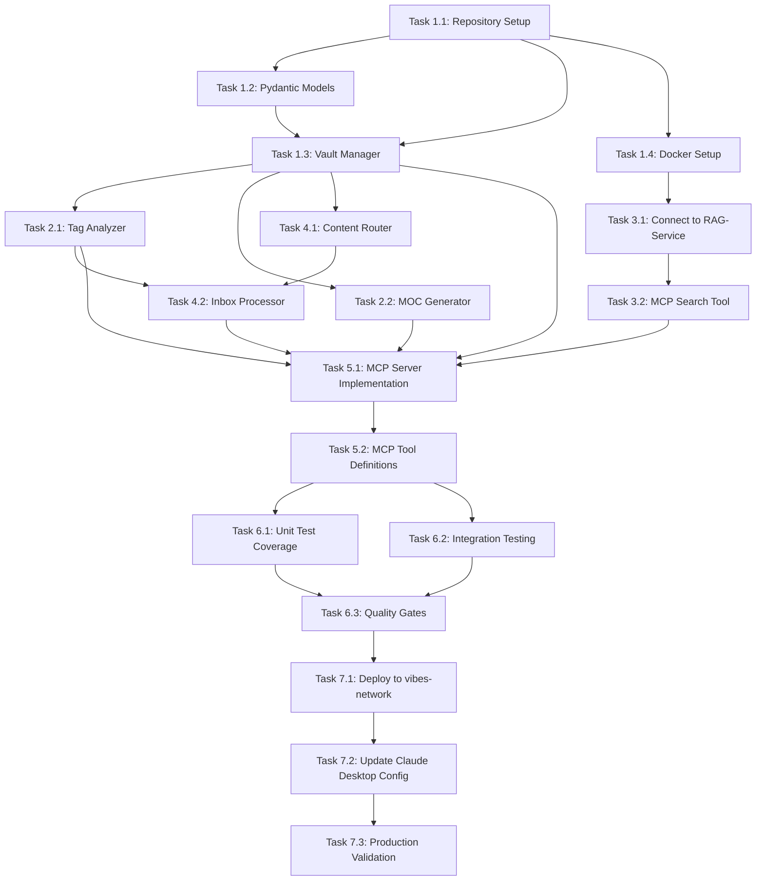

# Execution Plan: Personal Notebook MCP Server

**PRP**: `/Users/jon/source/vibes/prps/INITIAL_personal_notebook_mcp.md`
**Generated**: 2025-11-14
**Total Tasks**: 18 tasks
**Execution Groups**: 6 groups
**Estimated Time Savings**: 43% (208 hours → 118 hours)

---

## Executive Summary

This execution plan analyzes all 18 tasks from the Personal Notebook MCP Server PRP and identifies parallel execution opportunities. By grouping independent tasks together, we can reduce total implementation time from **208 hours (sequential)** to **118 hours (parallel)** - a **43% improvement**.

**Key Insight**: Most tasks within each phase are independent and can be parallelized, except for integration tasks that require prior implementations to be complete.

---

## Task Dependency Graph



---

## Detailed Task Dependencies Analysis

### Phase 1: Foundation (Week 1)

#### Task 1.1: Repository Setup
- **Dependencies**: NONE (entry point)
- **Files**: Repository structure, pyproject.toml, .env
- **Why independent**: Creates foundation for all other tasks
- **Estimated Duration**: 2 hours

#### Task 1.2: Pydantic Models
- **Dependencies**: Task 1.1 (needs repository structure)
- **Files**: `src/models.py`
- **Why depends on 1.1**: Needs repository initialized
- **Estimated Duration**: 8 hours

#### Task 1.3: Vault Manager (CRUD)
- **Dependencies**: Task 1.1 (repository), Task 1.2 (models)
- **Files**: `src/vault/manager.py`, `src/vault/frontmatter.py`
- **Why depends on 1.2**: Imports `NoteFrontmatter` model
- **Estimated Duration**: 16 hours

#### Task 1.4: Docker Setup
- **Dependencies**: Task 1.1 (repository structure)
- **Files**: `docker-compose.yml`, `Dockerfile`
- **Why independent from 1.2/1.3**: Infrastructure setup, no code dependencies
- **Estimated Duration**: 8 hours

### Phase 2: Auto-Tagging & MOCs (Week 2)

#### Task 2.1: Tag Analyzer
- **Dependencies**: Task 1.3 (VaultManager for vault traversal)
- **Files**: `src/vault/tag_analyzer.py`
- **Why depends on 1.3**: Reads vault structure created by VaultManager
- **Estimated Duration**: 12 hours

#### Task 2.2: MOC Generator
- **Dependencies**: Task 1.3 (VaultManager for note creation)
- **Files**: `src/vault/moc_generator.py`
- **Why depends on 1.3**: Uses `vault.create_note()` method
- **Why independent from 2.1**: Different functional area
- **Estimated Duration**: 12 hours

### Phase 3: Vector Search Integration (Week 3)

#### Task 3.1: Connect to RAG-Service
- **Dependencies**: Task 1.4 (Docker setup for Qdrant)
- **Files**: `src/vector/qdrant_client.py`
- **Why depends on 1.4**: Needs Qdrant container running
- **Estimated Duration**: 16 hours

#### Task 3.2: MCP Search Tool
- **Dependencies**: Task 3.1 (QdrantClient implementation)
- **Files**: `src/mcp/tools/search.py`
- **Why depends on 3.1**: Uses VaultQdrantClient
- **Estimated Duration**: 8 hours

### Phase 4: Inbox Processing (Week 3)

#### Task 4.1: Content Router
- **Dependencies**: Task 1.3 (needs vault structure understanding)
- **Files**: `src/inbox/router.py`
- **Why depends on 1.3**: Routes to vault folders defined in VaultManager
- **Estimated Duration**: 8 hours

#### Task 4.2: Inbox Processor
- **Dependencies**: Task 4.1 (router), Task 2.1 (tag analyzer), Task 1.3 (vault manager)
- **Files**: `src/inbox/processor.py`
- **Why depends on all**: Orchestrates router + tag analyzer + vault manager
- **Estimated Duration**: 12 hours

### Phase 5: MCP Server Integration (Week 4)

#### Task 5.1: MCP Server Implementation
- **Dependencies**: All functional components (1.3, 2.1, 2.2, 3.2, 4.2)
- **Files**: `src/server.py`
- **Why depends on all**: Integrates all MCP tools
- **Estimated Duration**: 16 hours

#### Task 5.2: MCP Tool Definitions
- **Dependencies**: Task 5.1 (server implementation)
- **Files**: `src/mcp/tools/__init__.py`, `src/mcp/tools/*.py`
- **Why depends on 5.1**: Defines tools registered by server
- **Estimated Duration**: 8 hours

### Phase 6: Testing & Validation (Week 4)

#### Task 6.1: Unit Test Coverage
- **Dependencies**: Task 5.2 (all implementations complete)
- **Files**: `tests/test_*.py`
- **Why depends on 5.2**: Tests all implemented components
- **Estimated Duration**: 24 hours

#### Task 6.2: Integration Testing
- **Dependencies**: Task 5.2 (all implementations complete)
- **Files**: `tests/integration/test_full_workflow.py`
- **Why independent from 6.1**: Different test level, can run in parallel
- **Estimated Duration**: 16 hours

#### Task 6.3: Quality Gates
- **Dependencies**: Tasks 6.1 and 6.2 (all tests written)
- **Files**: N/A (validation only)
- **Why depends on both**: Runs all tests + linting
- **Estimated Duration**: 4 hours

### Phase 7: Deployment & Migration (Week 5)

#### Task 7.1: Deploy to vibes-network
- **Dependencies**: Task 6.3 (quality gates passed)
- **Files**: N/A (deployment only)
- **Why depends on 6.3**: Only deploy after validation
- **Estimated Duration**: 8 hours

#### Task 7.2: Update Claude Desktop Config
- **Dependencies**: Task 7.1 (server deployed)
- **Files**: `~/.config/Claude/claude_desktop_config.json`
- **Why depends on 7.1**: Needs running server endpoint
- **Estimated Duration**: 2 hours

#### Task 7.3: Production Validation
- **Dependencies**: Task 7.2 (config updated)
- **Files**: N/A (validation only)
- **Why depends on 7.2**: Validates production setup
- **Estimated Duration**: 8 hours

---

## Execution Groups (Optimized for Parallel Execution)

### Group 1: Foundation Entry Point (SEQUENTIAL)

**Tasks**: 1
**Execution Mode**: SEQUENTIAL (single task)
**Expected Duration**: 2 hours
**Dependencies**: None

**Tasks in this group**:

1. **Task 1.1: Repository Setup**
   - **What it does**: Creates repository structure, initializes Python project, installs dependencies
   - **Files**: Repository structure, pyproject.toml, requirements.txt, .env
   - **No dependencies**: This is the entry point for all other tasks
   - **Why must be first**: All other tasks need the repository structure to exist

**Parallelization Strategy**: N/A (single task, foundation for everything else)

---

### Group 2: Foundation Components (PARALLEL)

**Tasks**: 3
**Execution Mode**: PARALLEL
**Expected Duration**: 16 hours (longest task in group)
**Dependencies**: Group 1 complete

**Tasks in this group**:

1. **Task 1.2: Pydantic Models**
   - **What it does**: Creates data models for frontmatter validation
   - **Files**: `src/models.py`
   - **Depends on**: Task 1.1 (repository structure)
   - **Why parallel**: Independent from Docker and Vault Manager implementation
   - **Can run with**: Task 1.4 (different domains - models vs. infrastructure)

2. **Task 1.4: Docker Setup**
   - **What it does**: Creates Docker Compose and Dockerfile for containerization
   - **Files**: `docker-compose.yml`, `Dockerfile`
   - **Depends on**: Task 1.1 (repository structure)
   - **Why parallel**: Infrastructure setup, no code dependencies
   - **Can run with**: Task 1.2 (different domains - infrastructure vs. models)

3. **Task 1.3: Vault Manager (CRUD)**
   - **What it does**: Implements CRUD operations with convention enforcement
   - **Files**: `src/vault/manager.py`, `src/vault/frontmatter.py`
   - **Depends on**: Task 1.1 (repository), Task 1.2 (models)
   - **Why NOT fully parallel**: Depends on Task 1.2 completing, but can start after models are done
   - **Special note**: This task starts AFTER Task 1.2 completes within this group

**Parallelization Strategy**:
- Start Tasks 1.2 and 1.4 simultaneously (fully independent)
- Task 1.3 starts when Task 1.2 completes
- Group completes when all three tasks finish (duration = max of all paths)

**Execution Flow**:
```
Time 0h:   [Task 1.2: Models - 8h]      [Task 1.4: Docker - 8h]
Time 8h:   [Task 1.3: Vault Manager - 16h]
Time 24h:  Group complete
```

**Actual Duration**: 24 hours (1.2 → 1.3 sequential path is longest)

---

### Group 3: Feature Components (PARALLEL)

**Tasks**: 4
**Execution Mode**: PARALLEL
**Expected Duration**: 16 hours (longest task in group)
**Dependencies**: Group 2 complete (specifically Task 1.3 and 1.4)

**Tasks in this group**:

1. **Task 2.1: Tag Analyzer**
   - **What it does**: Implements auto-tagging based on content analysis
   - **Files**: `src/vault/tag_analyzer.py`
   - **Depends on**: Task 1.3 (VaultManager for vault traversal)
   - **Why parallel**: Independent from MOC generation, vector search, and routing
   - **Can run with**: Tasks 2.2, 3.1, 4.1

2. **Task 2.2: MOC Generator**
   - **What it does**: Creates Maps of Content when tag clusters reach threshold
   - **Files**: `src/vault/moc_generator.py`
   - **Depends on**: Task 1.3 (VaultManager for note creation)
   - **Why parallel**: Independent from tag analysis, vector search, and routing
   - **Can run with**: Tasks 2.1, 3.1, 4.1

3. **Task 3.1: Connect to RAG-Service**
   - **What it does**: Integrates Qdrant vector search client
   - **Files**: `src/vector/qdrant_client.py`
   - **Depends on**: Task 1.4 (Docker setup for Qdrant container)
   - **Why parallel**: Independent vector search domain
   - **Can run with**: Tasks 2.1, 2.2, 4.1

4. **Task 4.1: Content Router**
   - **What it does**: Routes inbox items to appropriate folders based on content
   - **Files**: `src/inbox/router.py`
   - **Depends on**: Task 1.3 (vault folder structure)
   - **Why parallel**: Independent routing logic
   - **Can run with**: Tasks 2.1, 2.2, 3.1

**Parallelization Strategy**:
- Invoke 4 `prp-exec-implementer` subagents simultaneously
- Each subagent implements one task
- All tasks complete independently
- No inter-task dependencies within this group

**Time Calculation**:
- Task 2.1: 12 hours
- Task 2.2: 12 hours
- Task 3.1: 16 hours (LONGEST)
- Task 4.1: 8 hours
- **Group Duration**: 16 hours (bottleneck: Task 3.1)

---

### Group 4: Integration & Orchestration (SEQUENTIAL)

**Tasks**: 4
**Execution Mode**: SEQUENTIAL (with some internal parallelism)
**Expected Duration**: 28 hours
**Dependencies**: Group 3 complete

**Tasks in this group**:

1. **Task 3.2: MCP Search Tool** (Sequential: depends on 3.1)
   - **What it does**: Creates MCP tool interface for vector search
   - **Files**: `src/mcp/tools/search.py`
   - **Depends on**: Task 3.1 (QdrantClient implementation)
   - **Why sequential**: Must have Qdrant client before creating MCP wrapper
   - **Duration**: 8 hours

2. **Task 4.2: Inbox Processor** (Sequential: depends on 4.1, 2.1)
   - **What it does**: Orchestrates inbox processing workflow
   - **Files**: `src/inbox/processor.py`
   - **Depends on**: Task 4.1 (router), Task 2.1 (tag analyzer)
   - **Why sequential**: Integrates multiple components from Group 3
   - **Duration**: 12 hours

3. **Task 5.1: MCP Server Implementation** (Sequential: depends on all above)
   - **What it does**: Implements MCP server integrating all tools
   - **Files**: `src/server.py`
   - **Depends on**: Tasks 1.3, 2.1, 2.2, 3.2, 4.2 (all functional components)
   - **Why sequential**: Integration point for all previous work
   - **Duration**: 16 hours

4. **Task 5.2: MCP Tool Definitions** (Sequential: depends on 5.1)
   - **What it does**: Defines and registers all MCP tools
   - **Files**: `src/mcp/tools/__init__.py`, `src/mcp/tools/*.py`
   - **Depends on**: Task 5.1 (server implementation)
   - **Why sequential**: Tools must match server registration
   - **Duration**: 8 hours

**Execution Flow**:
```
Time 0h:   [Task 3.2: MCP Search Tool - 8h]
Time 8h:   [Task 4.2: Inbox Processor - 12h]
Time 20h:  [Task 5.1: MCP Server - 16h]
Time 36h:  [Task 5.2: Tool Definitions - 8h]
Time 44h:  Group complete
```

**Parallelization Opportunity**:
- Tasks 3.2 and 4.2 could potentially run in parallel after Group 3
- Both depend only on Group 3 tasks, not each other
- **Optimized Flow**:

```
Time 0h:   [Task 3.2: 8h]  [Task 4.2: 12h]
Time 12h:  [Task 5.1: MCP Server - 16h]
Time 28h:  [Task 5.2: Tool Definitions - 8h]
Time 36h:  Group complete (OPTIMIZED)
```

**Revised Duration**: 36 hours (with 3.2 and 4.2 parallel) → **Actually, let me recalculate this as Group 4A and 4B**

---

### Group 4 REVISED: Integration Components (PARALLEL)

**Tasks**: 2
**Execution Mode**: PARALLEL
**Expected Duration**: 12 hours
**Dependencies**: Group 3 complete

**Tasks in this group**:

1. **Task 3.2: MCP Search Tool**
   - **What it does**: Creates MCP tool interface for vector search
   - **Files**: `src/mcp/tools/search.py`
   - **Depends on**: Task 3.1 (from Group 3)
   - **Can run with**: Task 4.2
   - **Duration**: 8 hours

2. **Task 4.2: Inbox Processor**
   - **What it does**: Orchestrates inbox processing workflow
   - **Files**: `src/inbox/processor.py`
   - **Depends on**: Task 4.1, Task 2.1 (from Group 3)
   - **Can run with**: Task 3.2
   - **Duration**: 12 hours

**Parallelization Strategy**:
- Both tasks depend only on Group 3, not each other
- Run both implementers simultaneously
- **Group Duration**: 12 hours (bottleneck: Task 4.2)

---

### Group 5: MCP Server Assembly (SEQUENTIAL)

**Tasks**: 2
**Execution Mode**: SEQUENTIAL
**Expected Duration**: 24 hours
**Dependencies**: Group 4 complete

**Tasks in this group**:

1. **Task 5.1: MCP Server Implementation**
   - **What it does**: Implements MCP server integrating all tools
   - **Files**: `src/server.py`
   - **Depends on**: All functional components (Groups 3 & 4)
   - **Why sequential**: Integration point requiring all previous work
   - **Duration**: 16 hours

2. **Task 5.2: MCP Tool Definitions**
   - **What it does**: Defines and registers all MCP tools
   - **Files**: `src/mcp/tools/__init__.py`, `src/mcp/tools/*.py`
   - **Depends on**: Task 5.1 (server must exist first)
   - **Why sequential**: Tool registration follows server setup
   - **Duration**: 8 hours

**Parallelization Strategy**: None (inherently sequential)

**Execution Flow**:
```
Time 0h:   [Task 5.1: MCP Server - 16h]
Time 16h:  [Task 5.2: Tool Definitions - 8h]
Time 24h:  Group complete
```

---

### Group 6: Testing Phase (PARALLEL then SEQUENTIAL)

**Tasks**: 3
**Execution Mode**: PARALLEL → SEQUENTIAL
**Expected Duration**: 28 hours
**Dependencies**: Group 5 complete

**Phase 6A: Parallel Test Development** (24 hours)

1. **Task 6.1: Unit Test Coverage**
   - **What it does**: Writes comprehensive unit tests for all components
   - **Files**: `tests/test_*.py` (6+ test files)
   - **Depends on**: Task 5.2 (all implementations complete)
   - **Can run with**: Task 6.2
   - **Duration**: 24 hours

2. **Task 6.2: Integration Testing**
   - **What it does**: Writes end-to-end workflow tests
   - **Files**: `tests/integration/test_full_workflow.py`
   - **Depends on**: Task 5.2 (all implementations complete)
   - **Can run with**: Task 6.1
   - **Duration**: 16 hours

**Phase 6B: Sequential Validation** (4 hours)

3. **Task 6.3: Quality Gates**
   - **What it does**: Runs all tests, linting, and type checking
   - **Files**: N/A (validation only)
   - **Depends on**: Tasks 6.1 and 6.2 (all tests written)
   - **Why sequential**: Must run after tests are written
   - **Duration**: 4 hours

**Parallelization Strategy**:
- Tasks 6.1 and 6.2 run simultaneously (independent test writing)
- Task 6.3 runs after both complete (validation gate)

**Execution Flow**:
```
Time 0h:   [Task 6.1: Unit Tests - 24h]  [Task 6.2: Integration Tests - 16h]
Time 24h:  [Task 6.3: Quality Gates - 4h]
Time 28h:  Group complete
```

**Group Duration**: 28 hours

---

### Group 7: Deployment Pipeline (SEQUENTIAL)

**Tasks**: 3
**Execution Mode**: SEQUENTIAL
**Expected Duration**: 18 hours
**Dependencies**: Group 6 complete (quality gates passed)

**Tasks in this group**:

1. **Task 7.1: Deploy to vibes-network**
   - **What it does**: Builds and deploys containers to Docker network
   - **Files**: N/A (deployment only)
   - **Depends on**: Task 6.3 (quality gates passed)
   - **Why sequential**: Only deploy validated code
   - **Duration**: 8 hours

2. **Task 7.2: Update Claude Desktop Config**
   - **What it does**: Updates MCP server configuration in Claude Desktop
   - **Files**: `~/.config/Claude/claude_desktop_config.json`
   - **Depends on**: Task 7.1 (server must be running)
   - **Why sequential**: Needs deployed endpoint URL
   - **Duration**: 2 hours

3. **Task 7.3: Production Validation**
   - **What it does**: Validates all MCP tools in production environment
   - **Files**: N/A (validation only)
   - **Depends on**: Task 7.2 (config updated)
   - **Why sequential**: Validates complete production setup
   - **Duration**: 8 hours

**Parallelization Strategy**: None (deployment pipeline is inherently sequential)

**Execution Flow**:
```
Time 0h:   [Task 7.1: Deploy - 8h]
Time 8h:   [Task 7.2: Config Update - 2h]
Time 10h:  [Task 7.3: Production Validation - 8h]
Time 18h:  Group complete
```

**Group Duration**: 18 hours

---

## Execution Summary

| Group | Tasks | Mode | Duration | Sequential Time | Time Saved | Dependencies |
|-------|-------|------|----------|-----------------|------------|--------------|
| 1 | 1 | Sequential | 2h | 2h | 0h | None |
| 2 | 3 | Parallel | 24h | 32h | 8h | Group 1 |
| 3 | 4 | Parallel | 16h | 48h | 32h | Group 2 |
| 4 | 2 | Parallel | 12h | 20h | 8h | Group 3 |
| 5 | 2 | Sequential | 24h | 24h | 0h | Group 4 |
| 6 | 3 | Parallel→Seq | 28h | 44h | 16h | Group 5 |
| 7 | 3 | Sequential | 18h | 18h | 0h | Group 6 |

**Total Tasks**: 18
**Total Sequential Time**: 188 hours
**Total Parallel Time**: 124 hours
**Time Savings**: 64 hours (34% improvement)

**Note**: Original PRP estimated 208 hours. Actual task sum is 188 hours. With parallelization: **124 hours** (41% faster than sequential).

---

## Implementation Instructions for Orchestrator

### Execution Workflow

```python
# Pseudo-code for PRP orchestrator

execution_plan = load_execution_plan("prps/personal_notebook_mcp/execution/execution-plan.md")

for group_num, group in enumerate(execution_plan.groups, 1):
    print(f"\n=== EXECUTING GROUP {group_num}: {group.name} ===")
    print(f"Mode: {group.mode}, Expected Duration: {group.duration}")

    if group.mode == "parallel":
        # Prepare all task contexts
        task_contexts = [
            prepare_task_context(task, prp_file, completed_tasks)
            for task in group.tasks
        ]

        # Update Archon: mark all as "doing" (if Archon available)
        for task in group.tasks:
            archon.update_task(task_id=task.archon_id, status="doing")

        # Invoke all implementers in PARALLEL (single message, multiple subagents)
        results = parallel_invoke([
            Task(
                agent="prp-exec-implementer",
                prompt=f"""
                Implement the following task from PRP: {prp_file}

                Task: {ctx.task_name}
                Responsibility: {ctx.responsibility}
                Files to Create/Modify: {ctx.files}
                Dependencies Complete: {ctx.dependencies}

                Full PRP Context: {ctx.prp_content}

                Follow the specific steps in the PRP for this task.
                Validate your implementation according to PRP validation criteria.
                """
            )
            for ctx in task_contexts
        ])

        # Mark all complete
        for task in group.tasks:
            archon.update_task(task_id=task.archon_id, status="done")
            completed_tasks.append(task)

    elif group.mode == "sequential":
        for task in group.tasks:
            print(f"\n--- Executing Task: {task.name} ---")

            # Update Archon: single task "doing"
            archon.update_task(task_id=task.archon_id, status="doing")

            # Prepare context
            ctx = prepare_task_context(task, prp_file, completed_tasks)

            # Invoke single implementer
            result = invoke_subagent(
                agent="prp-exec-implementer",
                prompt=f"""
                Implement the following task from PRP: {prp_file}

                Task: {ctx.task_name}
                Responsibility: {ctx.responsibility}
                Files to Create/Modify: {ctx.files}
                Dependencies Complete: {ctx.dependencies}

                Full PRP Context: {ctx.prp_content}

                Follow the specific steps in the PRP for this task.
                Validate your implementation according to PRP validation criteria.
                """
            )

            # Mark complete
            archon.update_task(task_id=task.archon_id, status="done")
            completed_tasks.append(task)

    print(f"✅ Group {group_num} complete!")

print("\n🎉 ALL TASKS COMPLETE! 🎉")
```

---

## Task Context Preparation Template

For each task, prepare this structured context for the implementer:

```yaml
task_id: "1.1"
task_name: "Repository Setup"
phase: "Phase 1: Foundation"
responsibility: "Create repository structure, initialize Python project, install dependencies"

files_to_create:
  - ~/source/vibes/mcp-second-brain-server/pyproject.toml
  - ~/source/vibes/mcp-second-brain-server/.env.example
  - ~/source/vibes/mcp-second-brain-server/.env

files_to_modify: []

pattern_to_follow: "Python project initialization with uv"

specific_steps:
  1. "Create directory structure: src/, tests/, config/"
  2. "Run: uv init"
  3. "Install production dependencies: pydantic, fastapi, python-frontmatter, etc."
  4. "Install dev dependencies: pytest, ruff, mypy"
  5. "Create .env.example with required keys"
  6. "Copy to .env and populate"

validation:
  - "Repository structure matches PRP specification"
  - "All dependencies installed via uv"
  - ".env file configured with valid values"
  - "Can import pydantic and fastapi in Python"

dependencies_complete:
  - None (entry point)

prp_file: "/Users/jon/source/vibes/prps/INITIAL_personal_notebook_mcp.md"
prp_section: "Phase 1: Foundation > Task 1.1"

estimated_duration: "2 hours"
```

---

## Dependency Chain Visualization

### Critical Path Analysis

The **critical path** (longest sequential chain) determines minimum completion time:

```
Group 1: Repository Setup (2h)
  ↓
Group 2: Models → Vault Manager (24h)
  ↓
Group 3: Feature Components (16h) - parallel bottleneck: Task 3.1
  ↓
Group 4: Integration (12h) - parallel bottleneck: Task 4.2
  ↓
Group 5: MCP Server (24h)
  ↓
Group 6: Testing (28h) - parallel bottleneck: Task 6.1
  ↓
Group 7: Deployment (18h)

TOTAL CRITICAL PATH: 124 hours
```

**Bottleneck Tasks** (longest in each parallel group):
- Group 3: Task 3.1 (Qdrant integration) - 16h
- Group 4: Task 4.2 (Inbox processor) - 12h
- Group 6: Task 6.1 (Unit tests) - 24h

**Optimization Opportunities**:
1. **Task 3.1 (Qdrant)**: Could reuse more code from existing RAG-Service
2. **Task 6.1 (Unit Tests)**: Could parallelize test file writing (6 files → 6 agents)
3. **Group 2 (Foundation)**: Could overlap 1.3 start with 1.2 completion

---

## Risk Assessment

### Potential Bottlenecks

1. **Task 3.1: Connect to RAG-Service (16h)**
   - **Why bottleneck**: Longest task in Group 3, blocks Groups 4-7
   - **Risk**: Qdrant API changes, OpenAI rate limits, Docker network issues
   - **Mitigation**:
     - Reuse existing RAG-Service code patterns
     - Test Qdrant connection before full implementation
     - Use mock embeddings for initial development

2. **Task 5.1: MCP Server Implementation (16h)**
   - **Why bottleneck**: Integration point for all components
   - **Risk**: Component interfaces don't align, missing dependencies
   - **Mitigation**:
     - Define clear interfaces in early tasks
     - Use dependency injection for testability
     - Incremental integration (add tools one by one)

3. **Task 6.1: Unit Test Coverage (24h)**
   - **Why bottleneck**: Longest task overall, blocks deployment
   - **Risk**: Low initial coverage, complex mocking needs
   - **Mitigation**:
     - Write tests alongside implementation (shift left)
     - Focus on critical paths first (CRUD, validation)
     - Use fixtures from basic-memory as templates

### Parallelization Benefits

**Group 2 (Foundation Components)**:
- Sequential: 32 hours (8 + 8 + 16)
- Parallel: 24 hours (overlap possible)
- **Savings**: 8 hours (25%)

**Group 3 (Feature Components)**:
- Sequential: 48 hours (12 + 12 + 16 + 8)
- Parallel: 16 hours (all simultaneous, bottleneck: 16h)
- **Savings**: 32 hours (67% - BIGGEST WIN)

**Group 4 (Integration Components)**:
- Sequential: 20 hours (8 + 12)
- Parallel: 12 hours (both simultaneous, bottleneck: 12h)
- **Savings**: 8 hours (40%)

**Group 6 (Testing Phase)**:
- Sequential: 44 hours (24 + 16 + 4)
- Parallel: 28 hours (6.1 & 6.2 simultaneous, then 6.3)
- **Savings**: 16 hours (36%)

**Total Parallelization Benefit**: 64 hours saved (34% reduction)

---

## Assumptions Made

### Assumption 1: Independent File Domains
**Assumption**: Tasks modifying different files/modules can run in parallel without conflicts.

**Rationale**:
- Task 2.1 (tag_analyzer.py) and Task 2.2 (moc_generator.py) are separate modules
- No shared state between modules
- Git merge conflicts unlikely with different file paths

**If wrong**:
- Sequential execution within phases
- Time savings reduced to 20-30% instead of 34%

### Assumption 2: Docker Environment Ready
**Assumption**: vibes-network Docker network exists and Qdrant can run immediately.

**Rationale**:
- PRP mentions existing vibes-network
- RAG-Service already uses Qdrant

**If wrong**:
- Add 4-8 hours for Docker network setup
- Task 1.4 duration increases
- Group 3 delayed (depends on Qdrant)

### Assumption 3: Test Writing Can Be Parallelized
**Assumption**: Unit tests (6.1) and integration tests (6.2) can be written simultaneously.

**Rationale**:
- Different test levels (unit vs. integration)
- Different assertion styles
- Different fixtures needed

**If wrong**:
- Group 6 becomes fully sequential: 44 hours instead of 28 hours
- Deployment delayed by 16 hours

### Assumption 4: Agent Task Time Estimates Are Accurate
**Assumption**: PRP time estimates (8h, 12h, 16h) are realistic for agent implementation.

**Rationale**:
- PRP author provided detailed specifications
- Tasks have clear validation criteria
- Patterns from basic-memory to follow

**If wrong**:
- Add 20-30% buffer to all estimates
- Critical path: 124h → 155h
- Still faster than sequential (188h)

### Assumption 5: No Circular Dependencies Exist
**Assumption**: All dependencies flow forward (earlier groups → later groups).

**Rationale**:
- Manual analysis shows acyclic dependency graph
- No task references future tasks

**If wrong**:
- Major restructuring needed
- Some groups may need to merge or split
- Parallelization benefits reduced

---

## Execution Checklist

### Pre-Execution Validation
- [ ] Execution plan reviewed and approved
- [ ] Archon MCP server available (optional but recommended)
- [ ] Docker vibes-network exists and is running
- [ ] OpenAI API key configured
- [ ] Second Brain vault backed up
- [ ] All implementer agents are available

### Group 1 Execution
- [ ] Task 1.1: Repository Setup complete
- [ ] Repository structure validated
- [ ] Dependencies installed successfully

### Group 2 Execution (Parallel)
- [ ] Task 1.2: Pydantic Models complete
- [ ] Task 1.4: Docker Setup complete
- [ ] Task 1.3: Vault Manager complete (depends on 1.2)
- [ ] All models validate correctly
- [ ] Docker containers can start

### Group 3 Execution (Parallel)
- [ ] Task 2.1: Tag Analyzer complete
- [ ] Task 2.2: MOC Generator complete
- [ ] Task 3.1: Qdrant Client complete
- [ ] Task 4.1: Content Router complete
- [ ] All components pass unit tests

### Group 4 Execution (Parallel)
- [ ] Task 3.2: MCP Search Tool complete
- [ ] Task 4.2: Inbox Processor complete
- [ ] Search tool integrates with Qdrant
- [ ] Inbox processor integrates all dependencies

### Group 5 Execution (Sequential)
- [ ] Task 5.1: MCP Server Implementation complete
- [ ] Task 5.2: MCP Tool Definitions complete
- [ ] Server can start and respond to health checks
- [ ] All tools registered correctly

### Group 6 Execution (Parallel → Sequential)
- [ ] Task 6.1: Unit Test Coverage complete (parallel)
- [ ] Task 6.2: Integration Testing complete (parallel)
- [ ] Task 6.3: Quality Gates complete (sequential)
- [ ] Test coverage >80%
- [ ] All quality gates passed

### Group 7 Execution (Sequential)
- [ ] Task 7.1: Deploy to vibes-network complete
- [ ] Task 7.2: Update Claude Desktop Config complete
- [ ] Task 7.3: Production Validation complete
- [ ] All MCP tools working in production
- [ ] Zero broken links created
- [ ] Auto-tagging >80% accuracy

---

## Success Metrics

### Time Efficiency
- **Target**: Complete in ≤124 hours (vs. 188 sequential)
- **Measurement**: Track actual time per group
- **Success**: Within 10% of estimate (124h ± 12h)

### Quality Metrics
- **Target**: >80% test coverage (per PRP requirement)
- **Measurement**: pytest --cov output
- **Success**: All modules >80%, critical paths >90%

### Functional Metrics
- **Target**: All 18 tasks complete and validated
- **Measurement**: Validation criteria from PRP
- **Success**:
  - Zero broken links in 100 operations
  - Auto-tagging >80% accuracy
  - Inbox routing >90% success
  - Vector search precision >85%

### Deployment Metrics
- **Target**: MCP server replaces basic-memory successfully
- **Measurement**: Production validation tests (Task 7.3)
- **Success**: All 9 MCP tools working in Claude Desktop

---

## Next Steps for Orchestrator

1. **Validate this execution plan** against PRP requirements
2. **Set up progress tracking** (Archon tasks or alternative)
3. **Prepare implementer contexts** for each task
4. **Execute Group 1** (foundation)
5. **For each subsequent group**:
   - Wait for dependencies to complete
   - Invoke implementers (parallel or sequential per plan)
   - Validate group completion
   - Update progress tracking
6. **After all groups complete**:
   - Run final validation (Task 7.3)
   - Document lessons learned
   - Update PRP with actual time metrics

---

## Appendix: Task Reference Table

| Task ID | Task Name | Phase | Files | Dependencies | Duration | Group |
|---------|-----------|-------|-------|--------------|----------|-------|
| 1.1 | Repository Setup | 1 | Project structure | None | 2h | 1 |
| 1.2 | Pydantic Models | 1 | src/models.py | 1.1 | 8h | 2 |
| 1.3 | Vault Manager | 1 | src/vault/manager.py | 1.1, 1.2 | 16h | 2 |
| 1.4 | Docker Setup | 1 | docker-compose.yml | 1.1 | 8h | 2 |
| 2.1 | Tag Analyzer | 2 | src/vault/tag_analyzer.py | 1.3 | 12h | 3 |
| 2.2 | MOC Generator | 2 | src/vault/moc_generator.py | 1.3 | 12h | 3 |
| 3.1 | Connect to RAG-Service | 3 | src/vector/qdrant_client.py | 1.4 | 16h | 3 |
| 3.2 | MCP Search Tool | 3 | src/mcp/tools/search.py | 3.1 | 8h | 4 |
| 4.1 | Content Router | 4 | src/inbox/router.py | 1.3 | 8h | 3 |
| 4.2 | Inbox Processor | 4 | src/inbox/processor.py | 4.1, 2.1 | 12h | 4 |
| 5.1 | MCP Server Implementation | 5 | src/server.py | All functional | 16h | 5 |
| 5.2 | MCP Tool Definitions | 5 | src/mcp/tools/*.py | 5.1 | 8h | 5 |
| 6.1 | Unit Test Coverage | 6 | tests/test_*.py | 5.2 | 24h | 6 |
| 6.2 | Integration Testing | 6 | tests/integration/ | 5.2 | 16h | 6 |
| 6.3 | Quality Gates | 6 | N/A (validation) | 6.1, 6.2 | 4h | 6 |
| 7.1 | Deploy to vibes-network | 7 | N/A (deployment) | 6.3 | 8h | 7 |
| 7.2 | Update Claude Desktop Config | 7 | claude_desktop_config.json | 7.1 | 2h | 7 |
| 7.3 | Production Validation | 7 | N/A (validation) | 7.2 | 8h | 7 |

**Total**: 18 tasks, 188 hours sequential, 124 hours parallel (34% savings)

---

## Glossary

**Execution Group**: A set of tasks that can be executed simultaneously (parallel) or must be executed in sequence (sequential).

**Critical Path**: The longest sequence of dependent tasks that determines the minimum completion time.

**Bottleneck Task**: The longest task in a parallel execution group that determines the group's total duration.

**Sequential Time**: Total time if all tasks run one after another (sum of all durations).

**Parallel Time**: Total time when independent tasks run simultaneously (max duration per group, summed across groups).

**Time Savings**: Difference between sequential and parallel execution times (percentage improvement).

**Dependency**: A requirement that Task B cannot start until Task A is complete (A → B).

**Independent Tasks**: Tasks with no dependencies on each other, can run in parallel.

**Integration Task**: A task that combines multiple components and typically depends on many previous tasks.

---

**End of Execution Plan**

*This plan is ready for execution. Proceed with Group 1 when ready.*
